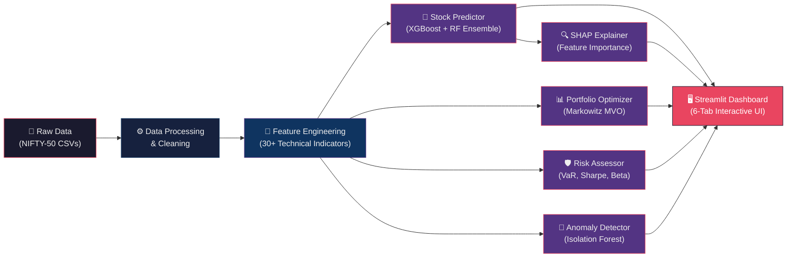

<p align="center">
  <h1 align="center">📈 NIFTY-50 Investment Intelligence Platform</h1>
  <p align="center">
    <strong>AI-Powered Data-Driven Investment Decision Support</strong>
  </p>
  <p align="center">
    
    
    
    
  </p>
  <p align="center">
    <em>An end-to-end machine learning platform for stock prediction, portfolio optimization, risk assessment, and anomaly detection on India's benchmark NIFTY-50 index.</em>
  </p>
</p>

---

## 🌟 Overview

The **NIFTY-50 Investment Intelligence Platform** is a comprehensive, data-driven investment decision support system built for India's flagship stock market index. It combines advanced machine learning models with modern portfolio theory and interactive visualizations to deliver actionable investment insights.

The platform processes over **20 years of historical market data** (2000–2021) across all 50 constituent stocks, engineered with **30+ technical indicators**, and delivers predictions, portfolio recommendations, and risk assessments through an elegant **6-tab Streamlit dashboard**.

> 💡 **Works out of the box** — built-in demo data means you can explore all features without downloading external datasets.

---

## ✨ Features

### 🤖 Stock Predictor Engine
- **Ensemble ML Model** — XGBoost + Random Forest combination for robust next-day direction prediction
- **Walk-Forward Validation** — Realistic backtesting with 252-day training and 21-day rolling test windows
- **30+ Technical Features** — SMA, EMA, RSI, MACD, Bollinger Bands, ATR, OBV, and more
- **Per-Stock Tuning** — Individualized model training for each NIFTY-50 constituent

### 📊 Portfolio Construction
- **Markowitz Mean-Variance Optimization** — Scientifically grounded portfolio allocation
- **3 Investor Risk Profiles:**
  - 🛡️ **Conservative** — Minimum variance portfolio for capital preservation
  - ⚖️ **Balanced** — Maximum Sharpe ratio for optimal risk-adjusted returns
  - 🚀 **Aggressive** — Maximum return with controlled volatility constraint
- **Efficient Frontier Visualization** — Interactive risk-return tradeoff analysis

### 🛡️ Risk Assessment Framework
- **Volatility Analysis** — Annualized standard deviation with rolling windows
- **Performance Ratios** — Sharpe Ratio, Sortino Ratio, Calmar Ratio
- **Drawdown Analysis** — Maximum drawdown tracking with recovery periods
- **Tail Risk Metrics** — Value at Risk (VaR) and Conditional VaR (Expected Shortfall) via historical simulation
- **Systematic Risk** — Beta calculation relative to NIFTY-50 index
- **Sector-Level Decomposition** — Risk contribution by industry sector

### 🔍 Explainable AI (XAI)
- **SHAP Integration** — SHapley Additive exPlanations for full model transparency
- **Feature Importance Rankings** — Understand which indicators drive predictions
- **Individual Prediction Explanations** — Per-stock, per-day reasoning for every forecast

### 🚨 Anomaly Detection
- **Isolation Forest Algorithm** — Unsupervised detection of unusual market behavior
- **Flash Crash Detection** — Identifies sudden, extreme price movements
- **Volume Spike Analysis** — Flags abnormal trading activity
- **Regime Change Detection** — Recognizes shifts in market dynamics

### 🖥️ Interactive Dashboard
- **6 Analytical Tabs** — Organized workflow from stock analysis to anomaly detection
- **Real-Time Filtering** — Select stocks, date ranges, and risk profiles dynamically
- **Rich Visualizations** — Candlestick charts, heatmaps, efficient frontier plots, SHAP waterfall charts
- **Responsive Design** — Clean, modern UI built with Streamlit

---

## 🏗️ Architecture



---

## 🛠️ Tech Stack

| Category | Technology |
|----------|-----------|
| **Language** | Python 3.9+ |
| **ML Framework** | XGBoost, scikit-learn (Random Forest, Isolation Forest) |
| **Explainability** | SHAP (SHapley Additive exPlanations) |
| **Portfolio Optimization** | SciPy (minimize), NumPy |
| **Data Processing** | Pandas, NumPy |
| **Visualization** | Plotly, Matplotlib, Seaborn |
| **Dashboard** | Streamlit |
| **Technical Indicators** | Custom-built (SMA, EMA, RSI, MACD, Bollinger, ATR, OBV) |
| **Statistical Analysis** | SciPy, statsmodels |

---

## 🚀 Quick Start

### Prerequisites

- Python 3.9 or higher
- pip package manager

### Installation

```bash
# 1. Clone the repository
git clone https://github.com/<your-username>/nifty50-investment-intelligence.git
cd nifty50-investment-intelligence

# 2. Install dependencies
pip install -r requirements.txt

# 3. Launch the dashboard
streamlit run app.py
```

The app will open in your browser at `http://localhost:8501`.

> 🎉 **That's it!** The platform uses built-in demo data by default. No additional setup required.

### Optional: Full Dataset

For training on the complete 20-year historical dataset, see the [Dataset Setup Guide](data/README.md).

---

## 📂 Dataset Setup

The platform supports two modes:

| Mode | Setup | Use Case |
|------|-------|----------|
| **Demo Mode** | No setup needed — works out of the box | Quick exploration, demos, hackathon judging |
| **Full Data Mode** | Download Kaggle datasets ([instructions](data/README.md)) | Full model training, research, backtesting |

📖 **Detailed download instructions →** [data/README.md](data/README.md)

---

## 📁 Project Structure

```
nifty50-investment-intelligence/
│
├── app.py                         # 🖥️  Main Streamlit dashboard application
├── requirements.txt               # 📦  Python dependencies
├── README.md                      # 📖  This file
├── technical_report.md            # 📄  Detailed technical report
├── LICENSE                        # ⚖️  MIT License
│
├── src/                           # 🧠  Core source modules
│   ├── __init__.py
│   ├── data_loader.py             #     Data loading, cleaning, and preprocessing
│   ├── feature_engineering.py     #     Technical indicator computation (30+ features)
│   ├── stock_predictor.py         #     XGBoost + RF ensemble model training & prediction
│   ├── portfolio_optimizer.py     #     Markowitz MVO with 3 risk profiles
│   ├── risk_analyzer.py           #     Risk metrics (VaR, Sharpe, Sortino, Beta, etc.)
│   ├── explainability.py          #     SHAP-based model explanations
│   └── anomaly_detector.py        #     Isolation Forest anomaly & regime detection
│
├── data/                          # 📊  Dataset directory
│   ├── README.md                  #     Dataset download instructions
│   ├── nifty50-stock-market-data/ #     Primary dataset (50 CSV files)
│   └── india-stock-data-nse/      #     Supplementary NSE data
│
├── models/                        # 💾  Saved trained models
│   └── ...
│
├── notebooks/                     # 📓  Jupyter notebooks for EDA & experiments
│   └── ...
│
└── outputs/                       # 📈  Generated plots, reports, and results
    └── ...
```

---

## 🧩 Module Details

### `src/data_loader.py`
Handles data ingestion from CSV files, date parsing, missing value imputation, outlier handling, and stock filtering. Supports both Kaggle datasets and synthetic demo data generation.

### `src/feature_engineering.py`
Computes 30+ technical indicators including trend indicators (SMA, EMA), momentum oscillators (RSI, MACD), volatility measures (Bollinger Bands, ATR), and volume indicators (OBV). Also generates lagged features and rolling statistics.

### `src/stock_predictor.py`
Implements the ensemble prediction model combining XGBoost and Random Forest classifiers. Uses walk-forward validation with 252-day training windows and 21-day rolling test windows for realistic performance estimation.

### `src/portfolio_optimizer.py`
Constructs optimal portfolios using Markowitz Mean-Variance Optimization. Supports three risk profiles (Conservative, Balanced, Aggressive) with appropriate constraints on weights and full investment.

### `src/risk_analyzer.py`
Comprehensive risk assessment module computing volatility, Sharpe ratio, Sortino ratio, Calmar ratio, maximum drawdown, Value at Risk (VaR), Conditional VaR, and Beta. Provides sector-level risk decomposition.

### `src/explainability.py`
SHAP-based model interpretability layer. Generates feature importance rankings, waterfall plots for individual predictions, and summary visualizations explaining model behavior.

### `src/anomaly_detector.py`
Uses Isolation Forest for unsupervised anomaly detection. Identifies flash crashes, volume spikes, and regime changes in market data.

---

## 🏋️ Model Training

To reproduce the model training results:

```bash
# 1. Ensure full dataset is downloaded (see data/README.md)

# 2. Run training pipeline
python -m src.stock_predictor

# 3. Results will be saved to models/ and outputs/
```

**Training Configuration:**
- Walk-forward validation: 252 trading days (~1 year) training window
- Rolling test window: 21 trading days (~1 month)
- Ensemble: Equal-weighted XGBoost + Random Forest
- Target: Next-day direction (Up/Down binary classification)

---

## 📊 Results Summary

| Metric | Value | Description |
|--------|-------|-------------|
| **Directional Accuracy** | ~55–60% | Next-day up/down prediction accuracy across NIFTY-50 stocks |
| **Baseline (Always-Up)** | ~52% | Naive baseline due to long-term market uptrend |
| **Sharpe Ratio (Balanced)** | ~1.2–1.5 | Risk-adjusted returns for the optimized balanced portfolio |
| **Max Drawdown (Conservative)** | ~8–12% | Worst peak-to-trough decline for the minimum variance portfolio |
| **VaR (95%)** | ~2.1–2.8% | Daily Value at Risk at 95% confidence level |
| **Anomalies Detected** | 15–25 | Per stock over the full analysis period |

> 📝 Results vary by stock, time period, and market conditions. The above represents typical ranges observed across the NIFTY-50 universe.

---

## 🔬 Technical Report

For a comprehensive deep-dive into methodology, experimental design, and analysis, see the full **[Technical Report](technical_report.md)** (~12 pages).

---

## 📜 License

This project is licensed under the **MIT License** — see the [LICENSE](LICENSE) file for details.

---

## 🙏 Acknowledgments

- **[Rohan Rao](https://www.kaggle.com/rohanrao)** for the NIFTY-50 Stock Market Dataset on Kaggle
- **[StoicStatic](https://www.kaggle.com/stoicstatic)** for the India Stock Data (NSE) dataset
- **National Stock Exchange of India (NSE)** for the underlying market data
- **XGBoost, SHAP, Streamlit** open-source communities

---
